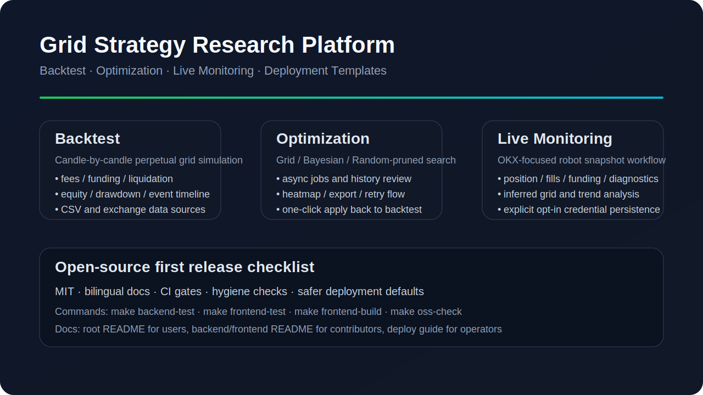
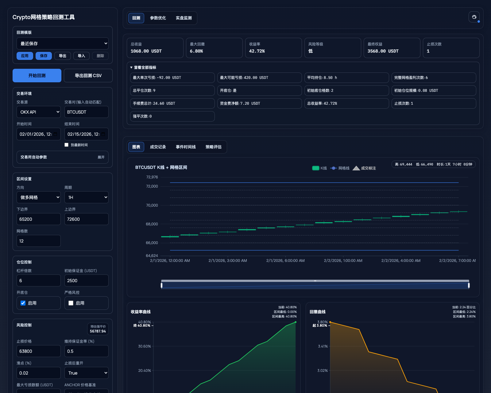
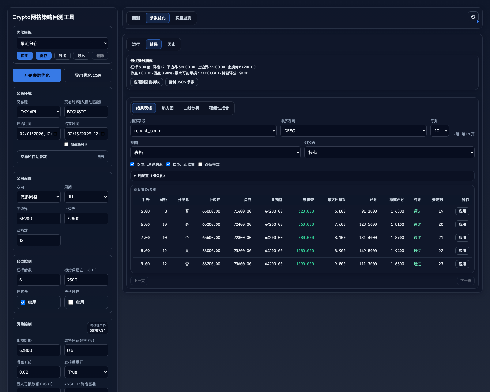
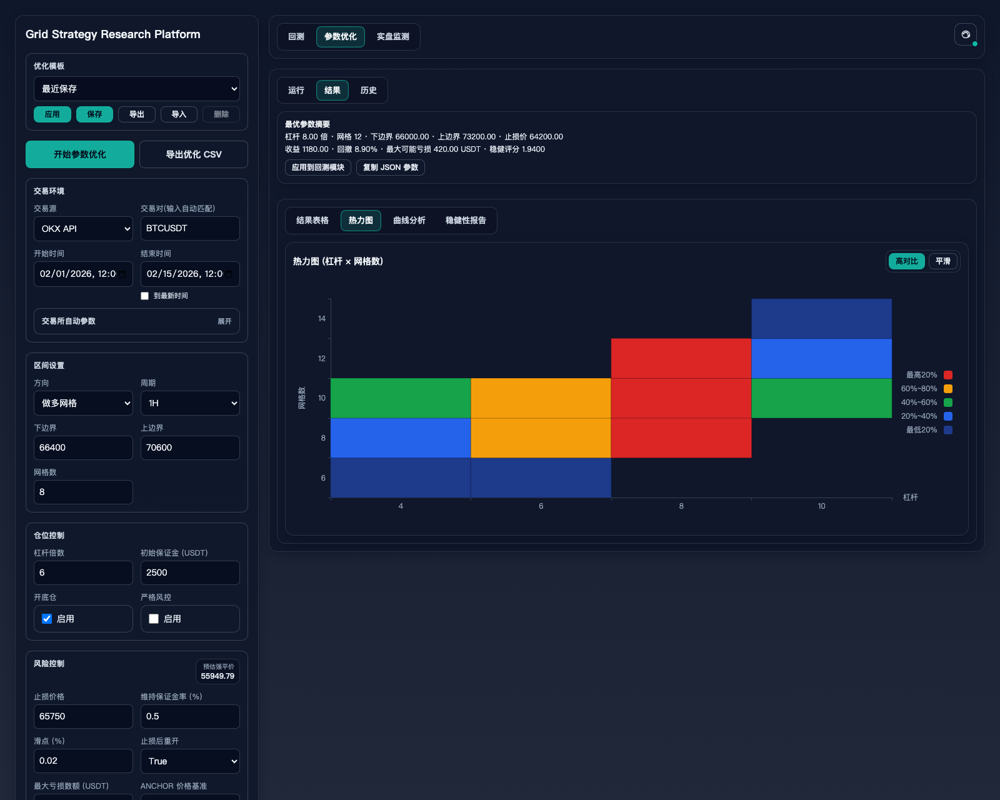
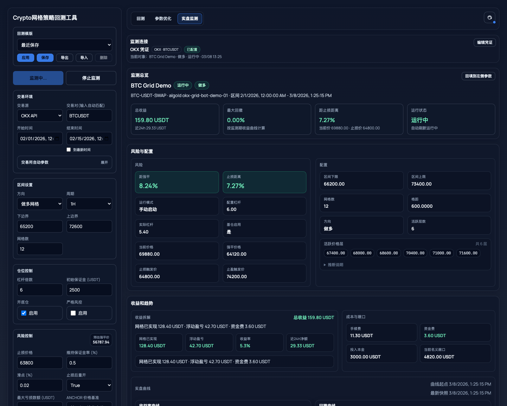

# Grid Strategy Research Platform

中文：面向永续合约网格策略研究的全功能 Web 工具，覆盖回测、参数优化、结构诊断、结果导出与实盘监测。  
English: A full-featured web app for perpetual futures grid strategy research, covering backtesting, optimization, diagnostics, exports, and live monitoring.

> This project is for research and validation workflows. It is **not** investment advice, trade execution software, or a guarantee of profitability.



## Overview / 项目简介

This repository is designed for self-hosted strategy research:

- **Backtest / 回测**: candle-by-candle perpetual futures grid simulation
- **Optimization / 优化**: grid, bayesian, and random-pruned search modes
- **Diagnostics / 诊断**: structure analysis, scoring, and risk-focused review
- **Live Monitoring / 实盘监测**: optional OKX-focused monitoring and reconciliation views
- **Deployment Templates / 部署模板**: Docker Compose and systemd examples

The project keeps the current public API stable and focuses on practical local or internal research workflows.

## Highlights / 核心能力

### Backtest / 回测
- Binance / Bybit / OKX / CSV data sources
- Long / short grid simulation with fees, slippage, funding, stop-loss, liquidation, and optional base position
- Equity, drawdown, leverage usage, liquidation price, event timeline, and trade table views

### Optimization / 参数优化
- `grid`, `bayesian`, `random_pruned`
- Search dimensions for leverage, grids, band width, stop-loss ratio, and optional base-position behavior
- Async jobs, history, retry/restore flow, heatmap, export, and one-click apply-to-backtest

### Live Monitoring / 实盘监测
- Current focus: OKX robot snapshot / monitoring workflow
- Position, open orders, fills, funding, inferred grid, diagnostics, and trend visualization
- Safer browser behavior: credentials should only persist when the user explicitly opts in

## Demo / 功能演示

This repository currently provides screenshot-based previews only and does **not** ship a public hosted demo.  
当前公开仓库仅提供截图形式的功能预览，**不提供**公网在线 Demo。

All screenshots below are generated from masked demo data for public documentation and use the checked-in `docs/assets/readme-*.png` assets.  
以下截图均基于脱敏演示数据生成，并直接使用仓库中的 `docs/assets/readme-*.png` 资源，仅用于公开仓库展示。

To regenerate the gallery assets locally:
`cd frontend && npm run capture:readme-screenshots`

| 回测总览 | 参数优化结果 |
| --- | --- |
|  |  |
| 左侧参数区与右侧回测结果同屏展示，可快速预览区间配置、收益指标与风险曲线。 | 排名结果、最优参数摘要与关键指标同屏展示，便于预览优化输出结构。 |

| 热力图分析 | 实盘监测面板 |
| --- | --- |
|  |  |
| 通过杠杆 × 网格数热力图预览参数区域分布，便于快速识别值得复核的区间。 | 以演示数据预览监测总览、风险配置、收益趋势与账单拆解视图，不包含真实账户信息。 |

If GIF previews are added later, the first replacement candidates will be the backtest overview and optimization results panels.  
如果后续补充 GIF 预览，优先替换“回测总览”或“参数优化结果”中的静态图片。

## Architecture / 架构概览

```text
frontend (React + Vite + TypeScript)
  ├─ parameter workspace
  ├─ backtest workspace
  ├─ optimization workspace
  └─ live monitoring workspace

backend (FastAPI)
  ├─ backtest services
  ├─ optimization services and job store
  ├─ live snapshot services and exchange adapters
  ├─ auth / audit / rate limit / concurrency guards
  └─ task backends (in-memory / Arq)
```

Useful developer docs:

- Backend: `backend/README.md`
- Frontend: `frontend/README.md`
- Deployment: `deploy/README.md`
- Config reference: `deploy/CONFIG_REFERENCE.md`
- Release checklist: `release/OPEN_SOURCE_RELEASE_CHECKLIST.md`

## Compatibility Policy / 兼容性策略

- HTTP API paths, request bodies, response bodies, and auth / rate-limit semantics stay backward compatible unless a breaking change is explicitly documented.
- Frontend transport contracts should be regenerated from OpenAPI in the same PR as any backend API change.
- UI state models may evolve internally, but visible workflow regressions should be covered by unit or e2e tests.

## Deployment Defaults / 部署默认分组

<!-- BEGIN GENERATED:CONFIG_SUMMARY -->
- Generated from `deploy/env.catalog.json`; rerun `make config-docs` after changing defaults.
- **Project**: Ports, logging, and CORS defaults that shape local and deployed runtime topology. Example keys: `COMPOSE_PROJECT_NAME`, `BACKEND_PORT`, `BACKEND_WORKERS`, `FRONTEND_PORT`.
- **Auth**: Authentication and JWT defaults for shared or public deployments. Example keys: `APP_AUTH_ENABLED`, `APP_PUBLIC_MODE`, `APP_AUTH_API_KEYS`, `APP_AUTH_BEARER_TOKENS`.
- **Task Backend**: Queue, Redis, and task backend settings for background job execution and state persistence. Example keys: `APP_TASK_BACKEND`, `APP_BACKTEST_TASK_BACKEND`, `APP_OPTIMIZATION_TASK_BACKEND`, `APP_ARQ_REDIS_DSN`.
- **Runtime Guards**: Rate-limit and concurrency ceilings that protect shared environments. Example keys: `APP_RATE_LIMIT_ENABLED`, `APP_RATE_LIMIT_WRITE_RPM`, `APP_RATE_LIMIT_IP_WRITE_RPM`, `APP_CONCURRENCY_LIMIT_ENABLED`.
- **Optimization Store**: Persistence, recovery, and retention limits for optimization/backtest job records. Example keys: `OPTIMIZATION_SELECTED_CLEAR_MAX`, `OPTIMIZATION_SELECTED_CLEAR_MAX_PUBLIC`, `OPTIMIZATION_RECOVERY_ENABLED`, `OPTIMIZATION_RECOVERY_MAX_JOBS`.
- **Frontend**: Build-time frontend API base and browser-side task recovery controls. Example keys: `VITE_API_BASE`, `VITE_JOB_RESUME_ENABLED`.
- Full generated tables live in `deploy/CONFIG_REFERENCE.md`.
<!-- END GENERATED:CONFIG_SUMMARY -->

## Requirements / 环境要求

- Python `3.11` recommended for a setup close to CI and Docker
- Node.js `20` recommended for frontend build / test parity
- Redis is optional for local private research mode and required when you enable Arq-backed task/state persistence
- Chromium is only needed if you run Playwright e2e or regenerate the README screenshots

## Quick Start / 快速开始

### Option A — one command / 一键启动

```bash
make dev
```

`make dev` bootstraps `backend/.venv` and `frontend/node_modules` when missing, then starts both services locally.  
`make dev` 会在缺少依赖时自动准备 `backend/.venv` 和 `frontend/node_modules`，随后启动前后端。

Default URLs:

- Frontend: `http://localhost:5173`
- Backend: `http://localhost:8000`

### Option B — manual setup / 手动启动

Backend:

```bash
cd backend
python3 -m venv .venv
source .venv/bin/activate
pip install -r requirements.txt
uvicorn app.main:app --reload --port 8000
```

Frontend:

```bash
cd frontend
npm ci
npm run dev
```

## Common Workflows / 常见使用流程

1. Fill market / strategy / risk inputs in the parameter panel.
2. Run a backtest and review metrics, curves, trades, and event timeline.
3. Start an optimization job and inspect ranked rows, heatmap, and robustness views.
4. Apply an optimized row back to the backtest panel for confirmation.
5. If needed, enable live monitoring with your own deployment and credentials.

## Examples / 最小示例

Minimal reproducible example files are included under `examples/`:

- `examples/backtest.request.json`
- `examples/optimization.request.json`
- `examples/sample-ohlcv.csv`

These examples are meant for local testing and documentation, not as trading recommendations.

## Tests and Quality Gates / 测试与质量门禁

Root commands:

```bash
make backend-test
make frontend-lint
make frontend-contract
make frontend-test
make frontend-build
make test
make oss-check
make review-surface
```

Direct commands:

```bash
backend/.venv/bin/python -m pytest backend/tests -q
cd frontend && npm run gen:api-types && git diff --exit-code -- src/lib/api.generated.ts
cd frontend && npm run lint && npm run test:unit && npm run build
```

Public release target:

- backend tests green
- frontend API types regenerated with no drift
- frontend lint / unit / build green
- repository hygiene check green
- README screenshots render correctly on GitHub
- no secrets, local paths, databases, or build outputs committed

## Deployment Modes / 部署方式

### Local research mode / 本地研究模式
- minimal friction
- suitable for local validation
- can run with relaxed auth settings for a private machine

### Public deployment mode / 公网部署模式
- enable authentication
- keep rate limiting and audit logging on
- use persistent state / Redis where required
- carefully review CORS and secret management

See `deploy/README.md` and `deploy/.env.example` for the deployment templates.

## Open Source Notes / 开源说明

- License: `MIT`
- Contribution guide: `CONTRIBUTING.md`
- Security policy: `SECURITY.md`
- Code of conduct: `CODE_OF_CONDUCT.md`

Suggested GitHub metadata is documented in `release/GITHUB_METADATA.md`.

## Risk Notice / 风险声明

- Historical performance does not imply future returns.
- Exchange rules, fee schedules, funding behavior, and liquidation logic should always be re-verified before any real-money usage.
- Live monitoring is an observational workflow, not an execution guarantee.
- Never commit real API keys, tokens, passphrases, or `.env` values.
