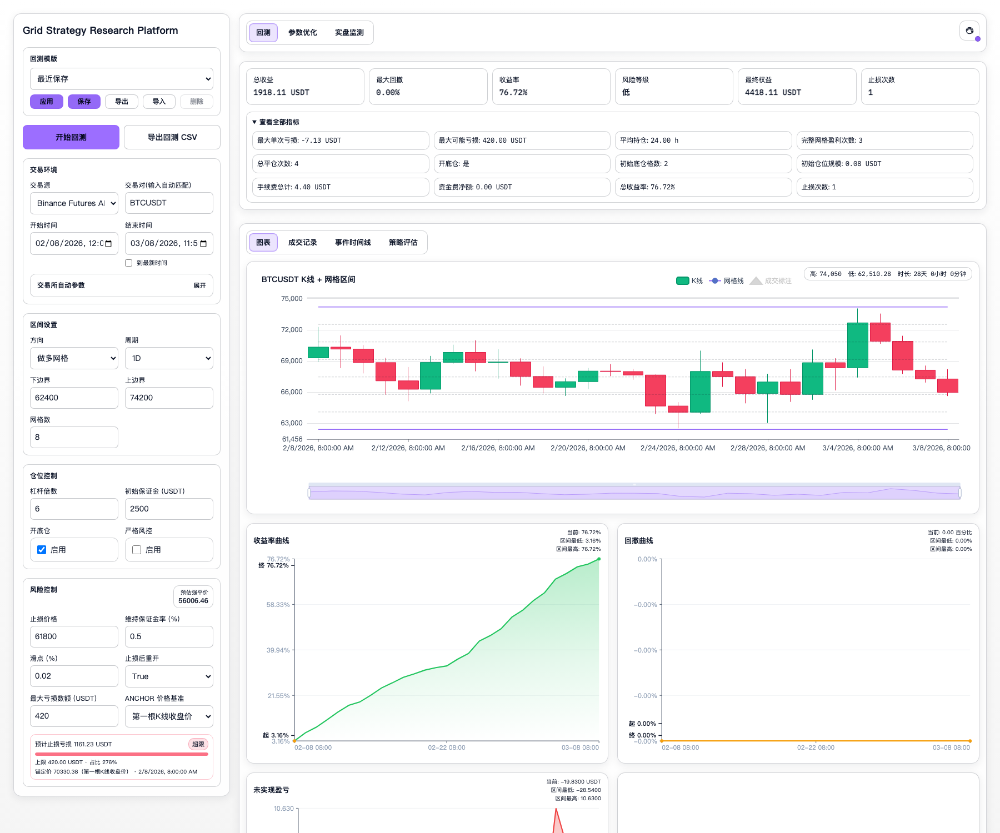
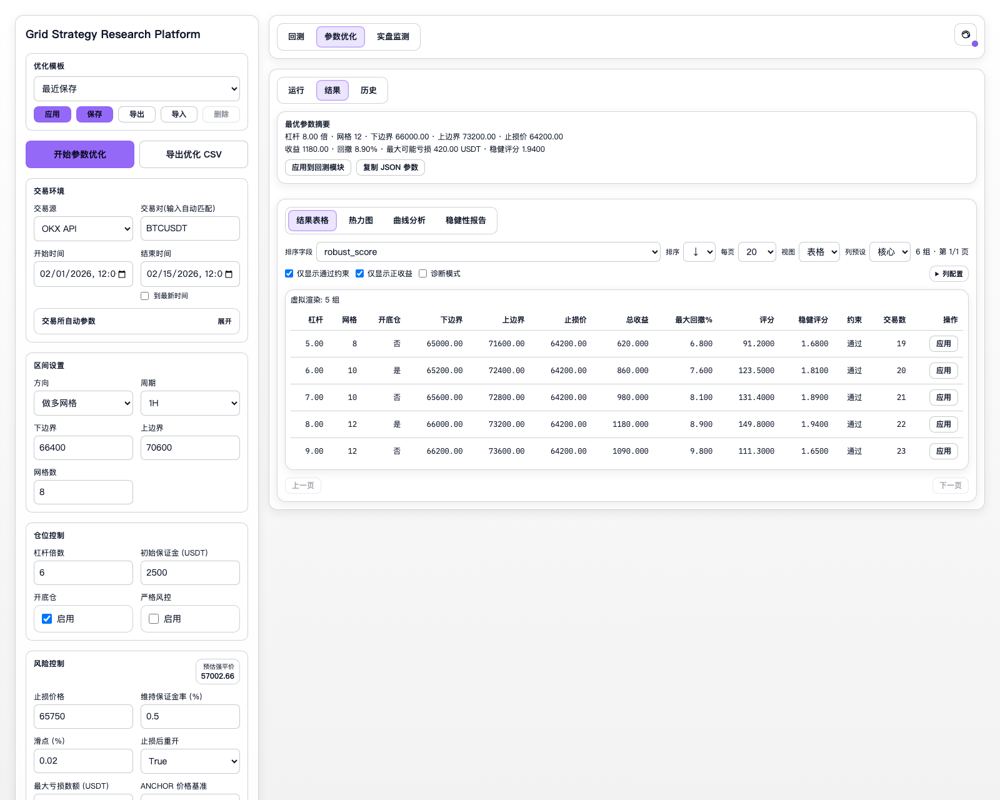
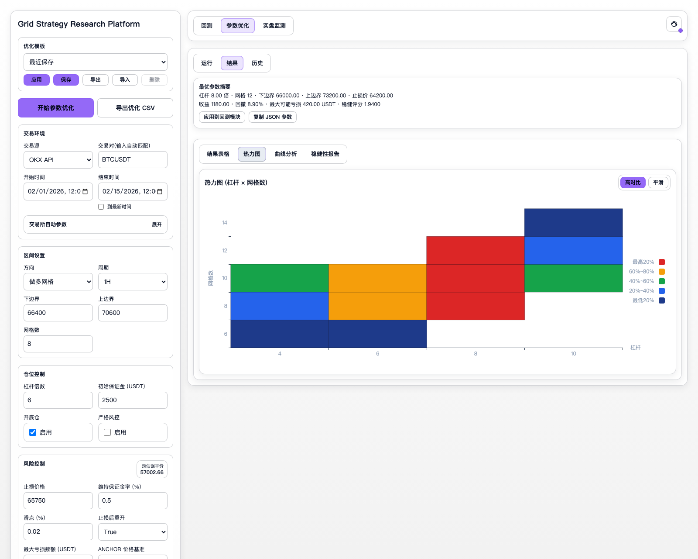
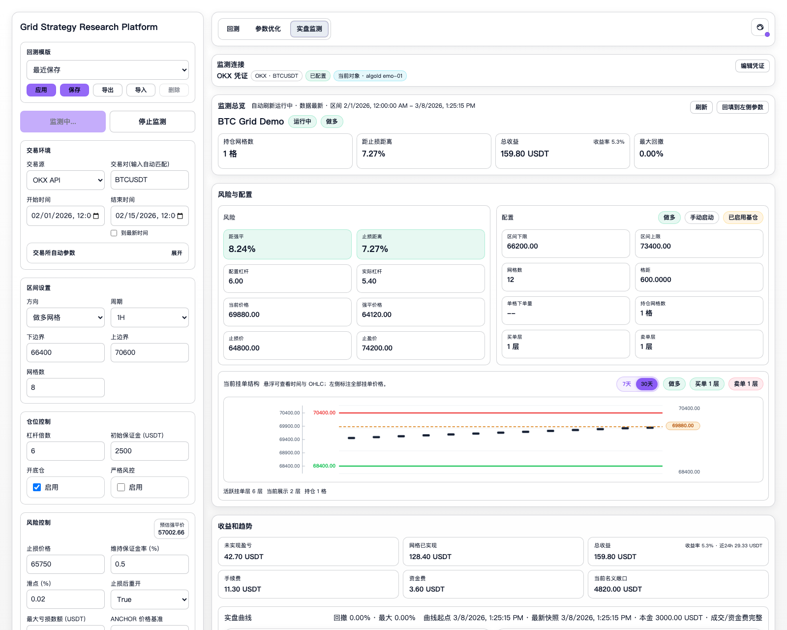

# 把我自用的网格策略研究平台开源了：回测、参数优化、实盘监测一体化

最近把一套自己长期在用的网格策略研究工具，整理成了开源项目：  
**Grid Strategy Research Platform**

GitHub 开源地址：  
[Grid Strategy Research Platform](https://github.com/Tan4096/Crypto_Grid_Strategy_Back_Test.git)

先说清楚定位：

- 这不是喊单工具
- 这不是自动交易承诺
- 这不是收益展示器
- 它是一个面向“研究与验证流程”的策略平台

我想解决的核心问题其实很简单：

- 一套参数到底是不是“可研究”的，而不只是看起来收益高？
- 优化出来的结果，是否有稳定区间，而不是偶然最优？
- 回测结论和实盘状态，能不能在一个界面里对照复核？

这次配图是我重新生成的一套小红书展示图：  
白底风格、统一主题色；回测 K 线使用了 **2026-02-08 到 2026-03-08 的 BTC 真实日线区间** 来做演示。

## 1）回测工作台

这一页是策略研究入口：

- 左侧填市场、区间、仓位、风控参数
- 右侧同步看收益、回撤、风险指标和曲线
- 适合做第一轮“参数假设筛选”

## 2）参数优化结果

不是只给一个“最优参数”，而是给一整套可比较结果：

- 候选组合排序
- 最优参数摘要
- 一键回填回测复核
- 同时看收益与风险，不只看收益单指标

## 3）热力图分析

这是我实际最常用的视角之一：

- 看参数区域分布，不盯单点冠军
- 找更稳的参数带，而不是偶然峰值
- 对判断过拟合很有帮助

## 4）实盘监测面板

这一块更偏观察和校验：

- 看机器人状态、持仓、挂单、成交、账单拆分
- 看收益趋势和风险状态
- 把回测假设和实盘表现放到同一视角里对照

## 技术栈

- 前端：`React` + `TypeScript` + `Vite`
- 后端：`FastAPI`
- 图表：ECharts
- 测试：Vitest / Playwright / Pytest
- 部署：Docker Compose + systemd 模板

## 这个项目更适合谁

- 在做量化研究工具的人
- 想搭回测 + 优化 + 监测闭环的人
- 对交易系统前后端工程化实现感兴趣的人
- 想看一个“从自用到开源”真实项目的人

如果你也在做类似方向，欢迎交流你最关注的模块：  
回测引擎、参数优化、监测视图，或者部署与安全策略。

---

#开源项目 #技术分享 #独立开发 #量化交易 #网格策略 #回测系统 #参数优化 #FastAPI #React #程序员
